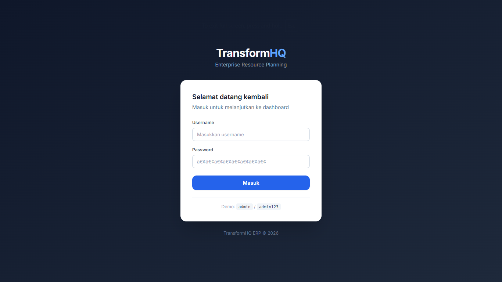
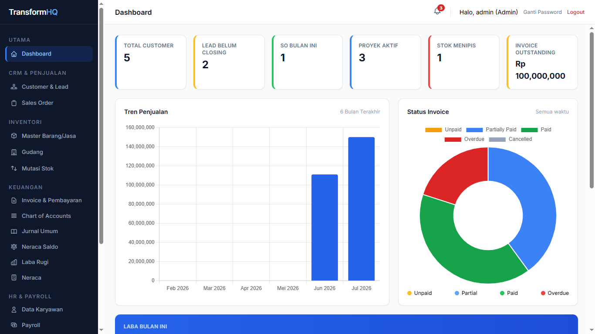
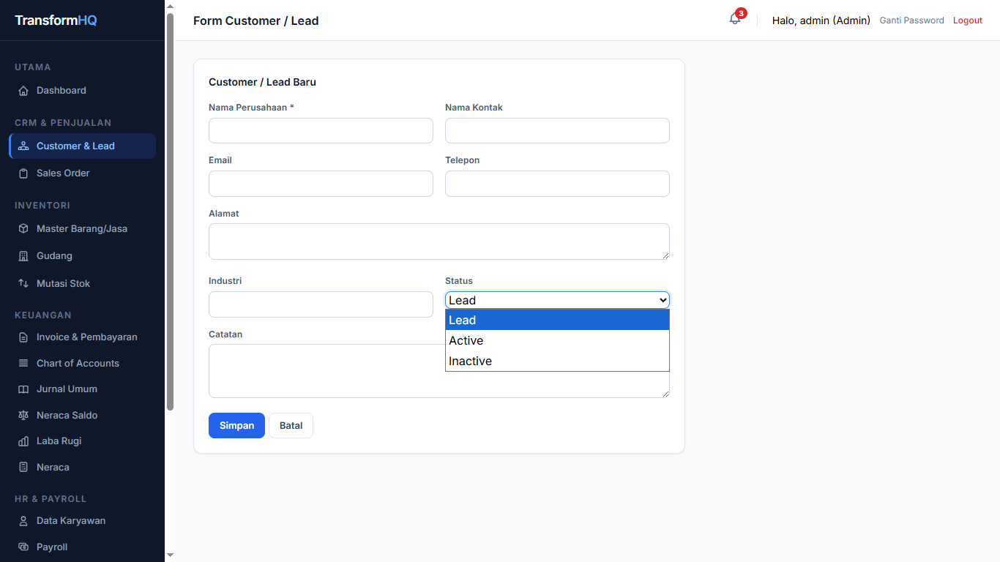
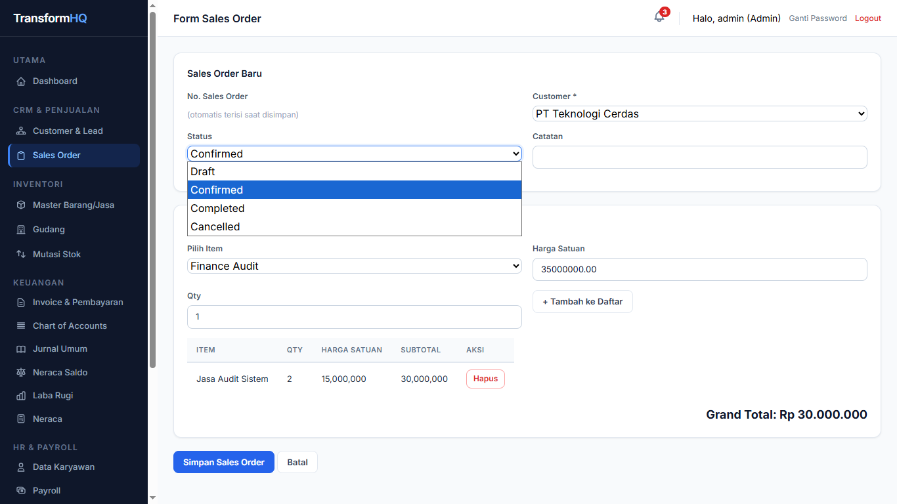
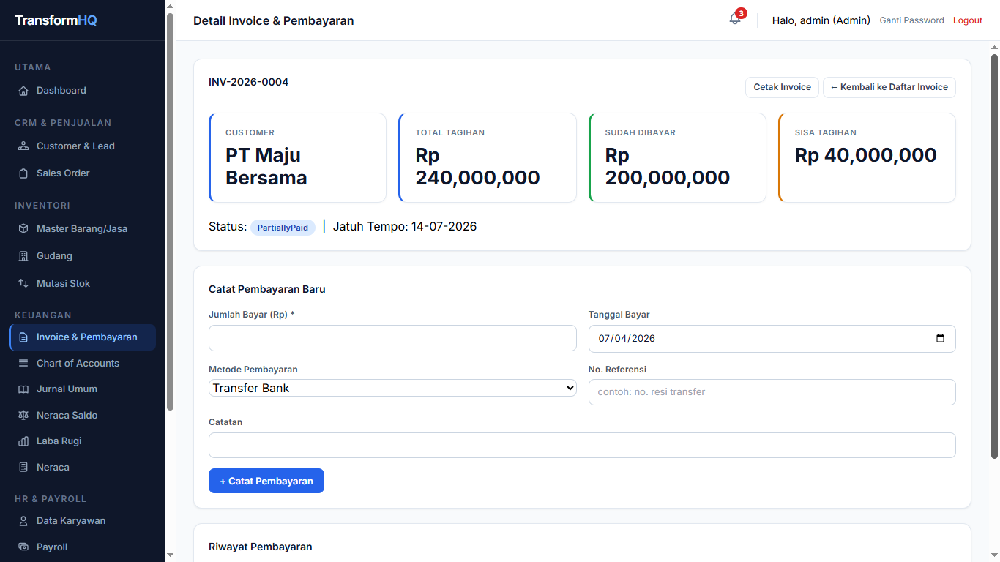
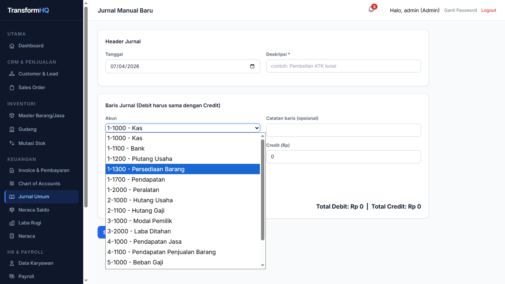
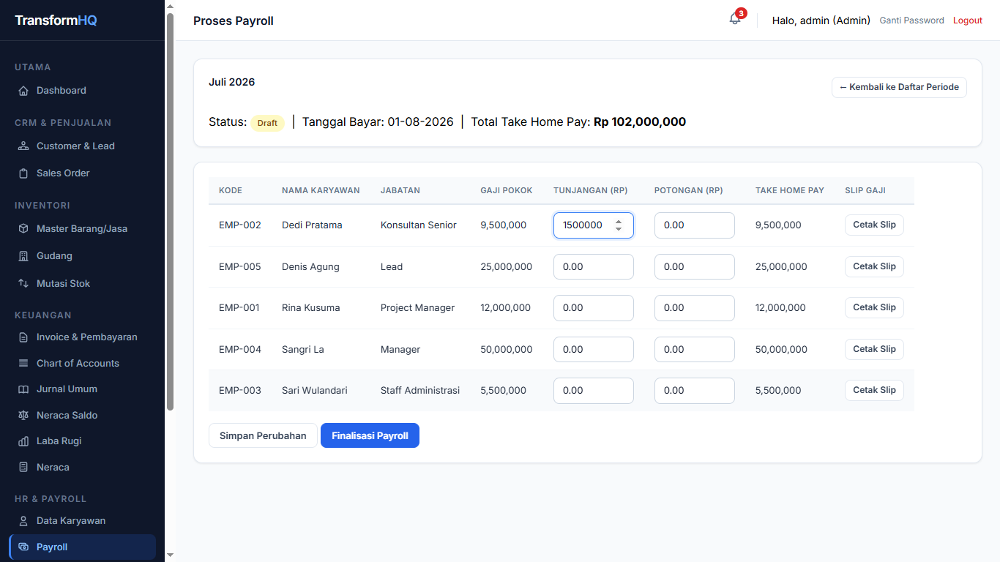
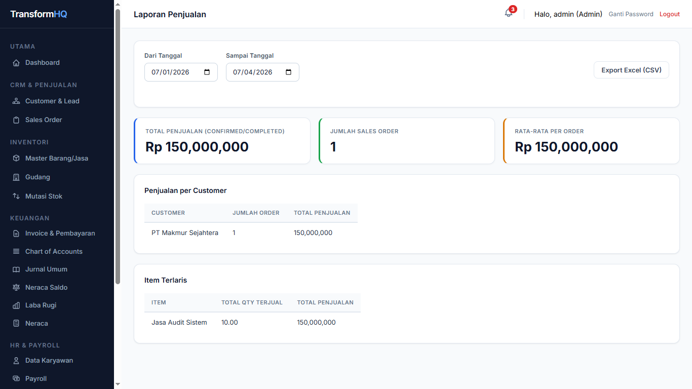

<div align="center">

# 🏢 TransformHQ ERP

**Enterprise Resource Planning untuk Bisnis Jasa & Konsultasi**

[](https://docs.microsoft.com/en-us/aspnet/web-forms/)
[](https://docs.microsoft.com/en-us/dotnet/visual-basic/)
[](https://www.microsoft.com/en-us/sql-server)
[](https://tailwindcss.com/)
[](https://visualstudio.microsoft.com/)
[](LICENSE)

<br/>

> Sistem ERP lengkap berbasis web untuk bisnis jasa & konsultasi — mencakup CRM, Sales, Inventori, Keuangan, Akuntansi (double-entry), HR & Payroll, Manajemen Proyek, serta Laporan & Analitik, semua dalam satu aplikasi terintegrasi dengan tampilan modern Tailwind CSS.

<br/>

[](screenshots/)

</div>

---

## 📋 Daftar Isi

- [Fitur Unggulan](#-fitur-unggulan)
- [Tech Stack](#-tech-stack)
- [Modul Lengkap](#-modul-lengkap)
- [Screenshot](#-screenshot)
- [Instalasi & Setup](#-instalasi--setup)
- [Akun Demo](#-akun-demo)
- [Struktur Project](#-struktur-project)
- [Kontribusi](#-kontribusi)
- [Lisensi](#-lisensi)

---

## ✨ Fitur Unggulan

<table>
<tr>
<td width="50%">

**🔄 Integrasi Otomatis**
- Auto stock-out saat Sales Order dikonfirmasi
- Auto-posting jurnal double-entry dari Invoice, Pembayaran & Payroll
- Status invoice dihitung real-time (Unpaid → Overdue → Paid)

</td>
<td width="50%">

**🔐 Role-Based Access Control**
- 3 role: Admin, Manager, Staff
- Menu sidebar otomatis menyesuaikan role
- Server-side guard di setiap halaman sensitif

</td>
</tr>
<tr>
<td width="50%">

**📊 Dashboard Interaktif**
- Grafik tren penjualan 6 bulan (Chart.js)
- Doughnut chart status invoice
- KPI real-time: Customer, SO, Proyek, Stok, Laba

</td>
<td width="50%">

**🔔 Notifikasi & Reminder**
- Bell icon di topbar semua halaman
- Invoice jatuh tempo (7 hari ke depan)
- Stok menipis & task proyek mendekati deadline

</td>
</tr>
<tr>
<td width="50%">

**📚 Akuntansi Double-Entry**
- Chart of Accounts lengkap
- Jurnal otomatis + manual
- Neraca Saldo, Laba Rugi, Neraca

</td>
<td width="50%">

**📤 Export & Cetak**
- Semua laporan bisa di-export ke Excel (CSV)
- Cetak Invoice & Slip Gaji (PDF via browser print)
- DataTables dengan sorting & search built-in

</td>
</tr>
</table>

---

## 🛠 Tech Stack

| Layer | Teknologi |
|-------|-----------|
| **Backend** | ASP.NET Web Forms 4.8, VB.NET |
| **Database** | Microsoft SQL Server 2022 |
| **UI Framework** | Tailwind CSS (Play CDN) |
| **Fonts** | Inter (Google Fonts) |
| **Charts** | Chart.js v4.4 |
| **Tables** | jQuery DataTables 1.13.8 |
| **IDE** | Visual Studio 2022 |
| **Auth** | ASP.NET Forms Authentication |
| **ORM** | ADO.NET (murni, tanpa Entity Framework) |

---

## 📦 Modul Lengkap

```
TransformHQ ERP
├── 🏠  Dashboard          → KPI, grafik tren, proyek & SO terbaru
├── 👥  CRM                → Customer & Lead pipeline
├── 📋  Sales              → Sales Order multi-item + auto stock-out
├── 📦  Inventori          → Master Barang/Jasa, Gudang, Mutasi Stok
├── 💳  Keuangan           → Invoice, Pembayaran, Cetak Invoice
├── 📚  Akuntansi          → Chart of Accounts, Jurnal, Neraca Saldo, Laba Rugi, Neraca
├── 👤  HR & Payroll       → Data Karyawan, Proses Payroll, Slip Gaji
├── 🗂️  Proyek             → Manajemen Proyek & Task (Kanban-style)
├── 📈  Laporan            → Laporan Penjualan & Stok (Export CSV)
├── 🔔  Notifikasi         → Reminder invoice, stok, & deadline task
└── ⚙️  Administrasi       → Manajemen User, Ganti Password
```

---

## 📸 Screenshot
<table>
<tr>
<td align="center" width="50%">

<br/><em>Login Page — Modern card dengan gradient gelap</em>
</td>
<td align="center" width="50%">

<br/><em>Dashboard — KPI cards, grafik Chart.js, data terbaru</em>
</td>
</tr>
<tr>
<td align="center" width="50%">

<br/><em>CRM — DataTables dengan search & sort otomatis</em>
</td>
<td align="center" width="50%">

<br/><em>Sales Order — Multi-item dengan auto hitung total</em>
</td>
</tr>
<tr>
<td align="center" width="50%">

<br/><em>Invoice & Pembayaran — Status real-time + riwayat</em>
</td>
<td align="center" width="50%">

<br/><em>Jurnal Akuntansi — Double-entry otomatis & manual</em>
</td>
</tr>
<tr>
<td align="center" width="50%">

<br/><em>Payroll — Proses gaji bulanan + cetak slip gaji</em>
</td>
<td align="center" width="50%">

<br/><em>Laporan Penjualan — Analitik per customer & item</em>
</td>
</tr>
</table>

## 🚀 Instalasi & Setup

### Prasyarat

- [Visual Studio 2022](https://visualstudio.microsoft.com/) (dengan workload **ASP.NET and web development**)
- [SQL Server 2022](https://www.microsoft.com/en-us/sql-server) (Express Edition sudah cukup)
- [SQL Server Management Studio (SSMS)](https://aka.ms/ssmsfullsetup)
- Koneksi internet (untuk Tailwind CDN, jQuery, Chart.js, Inter font)

### Langkah 1 — Setup Database

1. Buka **SSMS**, konek ke instance SQL Server 2022 kamu
2. Buka file `Database/01_Create_Database_And_Schema.sql`
3. Tekan **F5** (Execute) — script ini akan membuat:
   - Database `ERP_JasaKonsultasi`
   - Semua tabel, relasi, & index
   - Data contoh (customers, items, sales order, proyek)
   - 3 akun login demo (admin, manager, staff)

> ⚠️ **Sudah punya database dari versi sebelumnya?**
> Jalankan script tambahan secara berurutan:
> ```
> Database/02_Finance_Module.sql      → tambah tabel Invoice & Payments
> Database/03_HR_Payroll_Module.sql   → tambah tabel Employees & Payroll
> Database/04_Accounting_Module.sql   → tambah tabel Chart of Accounts & Journal
> ```

### Langkah 2 — Konfigurasi Connection String

Buka `ERP_JasaKonsultasi/Web.config` dan sesuaikan:

```xml
<connectionStrings>
  <add name="ERPConnectionString"
       connectionString="Data Source=NAMA_SERVER;Initial Catalog=ERP_JasaKonsultasi;
                         User ID=sa;Password=PASSWORD_KAMU;
                         Integrated Security=False;MultipleActiveResultSets=True;
                         TrustServerCertificate=True;"
       providerName="System.Data.SqlClient" />
</connectionStrings>
```

**Contoh untuk Windows Authentication (tanpa username/password):**
```xml
connectionString="Data Source=localhost;Initial Catalog=ERP_JasaKonsultasi;
                  Integrated Security=True;TrustServerCertificate=True;"
```

### Langkah 3 — Jalankan Aplikasi

```
1. Buka file ERP_JasaKonsultasi.sln di Visual Studio 2022
2. Build → Clean Solution
3. Build → Rebuild Solution
4. Tekan F5 (atau klik tombol IIS Express)
5. Browser akan membuka localhost:44301/Login.aspx
```

---

## 🔑 Akun Demo

| Username | Password | Role | Akses |
|----------|----------|------|-------|
| `admin` | `admin123` | **Admin** | Semua modul + Manajemen User |
| `manager` | `manager123` | **Manager** | Semua modul kecuali Manajemen User |
| `staff` | `staff123` | **Staff** | CRM, Sales, Inventori, Proyek |

> Password di-hash dengan **SHA256** di database. Untuk mengganti password, login sebagai Admin → menu **Manajemen User**, atau user bisa ganti sendiri lewat link **Ganti Password** di topbar.

---

## 📁 Struktur Project

```
TransformHQ-ERP/
├── 📁 Database/
│   ├── 01_Create_Database_And_Schema.sql   ← Instalasi lengkap (fresh install)
│   ├── 02_Finance_Module.sql               ← Tambahan modul Finance
│   ├── 03_HR_Payroll_Module.sql            ← Tambahan modul HR & Payroll
│   └── 04_Accounting_Module.sql            ← Tambahan modul Akuntansi
│
├── 📁 ERP_JasaKonsultasi/                  ← Project utama VS2022
│   ├── 📁 App_Code/
│   │   ├── DBHelper.vb                     ← ADO.NET helper (koneksi & query)
│   │   ├── AuthHelper.vb                   ← Role-Based Access Control
│   │   ├── JournalHelper.vb                ← Auto-posting jurnal double-entry
│   │   ├── CsvHelper.vb                    ← Export DataTable → CSV/Excel
│   │   └── NotificationHelper.vb           ← Reminder (invoice, stok, task)
│   │
│   ├── 📁 CRM/           → Customer & Lead
│   ├── 📁 Sales/         → Sales Order
│   ├── 📁 Inventory/     → Barang, Gudang, Stok
│   ├── 📁 Finance/       → Invoice & Pembayaran
│   ├── 📁 Accounting/    → COA, Jurnal, Neraca Saldo, Laba Rugi, Neraca
│   ├── 📁 HR/            → Karyawan & Payroll
│   ├── 📁 Projects/      → Proyek & Task
│   ├── 📁 Reports/       → Laporan Penjualan & Stok
│   ├── 📁 Admin/         → Manajemen User
│   ├── 📁 Content/       → site.css (Tailwind hybrid)
│   ├── 📁 Scripts/       → site.js (DataTables init)
│   │
│   ├── Site.master       ← Layout utama (sidebar + topbar + notifikasi)
│   ├── Login.aspx        ← Halaman login
│   ├── Default.aspx      ← Dashboard
│   └── Web.config        ← Konfigurasi app & connection string
│
├── 📁 screenshots/       ← Screenshot untuk README (isi manual)
├── ERP_JasaKonsultasi.sln
└── README.md
```

---


## 🤝 Kontribusi

Kontribusi sangat disambut! Berikut cara berkontribusi:

1. **Fork** repository ini
2. Buat branch baru: `git checkout -b fitur/nama-fitur-baru`
3. Commit perubahan: `git commit -m "feat: tambah fitur X"`
4. Push ke branch: `git push origin fitur/nama-fitur-baru`
5. Buat **Pull Request** ke branch `main`

### Konvensi Commit

```
feat:     fitur baru
fix:      perbaikan bug
docs:     perubahan dokumentasi
style:    perubahan tampilan/CSS
refactor: refactoring kode (tidak ada fitur/bug)
chore:    maintenance (update dependency, dll)
```

### Area yang Bisa Dikembangkan

- [ ] Closing entries / tutup buku akhir tahun (akuntansi)
- [ ] Notifikasi email (SMTP integration)
- [ ] Upload lampiran file (bukti transfer, kontrak)
- [ ] Multi-warehouse pada Sales Order
- [ ] Export ke format Excel asli (.xlsx via ClosedXML)
- [ ] Audit log lengkap (siapa mengubah apa, kapan)
- [ ] Modul Purchasing (Purchase Order, supplier management)
- [ ] Dashboard mobile-responsive yang lebih optimal

---

## 📄 Lisensi

Project ini dilisensikan di bawah **MIT License** — bebas digunakan, dimodifikasi, dan didistribusikan untuk keperluan apapun dengan mencantumkan attribution.

```
MIT License

Copyright (c) 2026 TransformHQ

Permission is hereby granted, free of charge, to any person obtaining a copy
of this software and associated documentation files (the "Software"), to deal
in the Software without restriction, including without limitation the rights
to use, copy, modify, merge, publish, distribute, sublicense, and/or sell
copies of the Software, and to permit persons to whom the Software is
furnished to do so, subject to the following conditions:

The above copyright notice and this permission notice shall be included in all
copies or substantial portions of the Software.
```

---

## 🙏 Acknowledgements

- [ASP.NET Web Forms](https://docs.microsoft.com/en-us/aspnet/web-forms/) — Backend framework
- [Tailwind CSS](https://tailwindcss.com/) — UI styling
- [Chart.js](https://www.chartjs.org/) — Visualisasi data dashboard
- [jQuery DataTables](https://datatables.net/) — Tabel interaktif
- [Inter Font](https://rsms.me/inter/) — Tipografi modern
- [Heroicons](https://heroicons.com/) — SVG icon di sidebar

---

<div align="center">

**⭐ Kalau project ini membantu, jangan lupa beri Star di GitHub!**

[🐛 Report Bug](https://github.com/USERNAME/transformhq-erp/issues) · [✨ Request Feature](https://github.com/USERNAME/transformhq-erp/issues) · [📖 Documentation](https://github.com/USERNAME/transformhq-erp/wiki)

</div>
